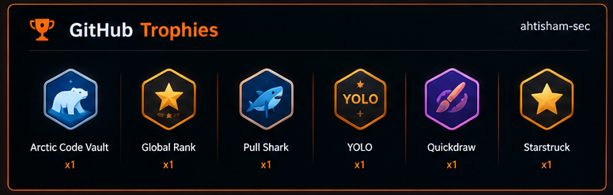

  

 

# Muhammad Ahtisham Aslam

### Cybersecurity Student · Web Security · Python · SEO

Building practical security tools and useful digital systems through hands-on work.

 

---

## 01 - About

I'm a **BS Information Technology student** focused on **web security, vulnerability assessment, Python security tooling, and technical SEO**.

I prefer learning by building: small security tools, practical automation, log analysis utilities, phishing detection workflows, and web-focused projects.

<table>
<tr>
<td align="center" width="25%">

**SECURITY**

Web Security 
Vulnerability Assessment 
OWASP Concepts

</td>
<td align="center" width="25%">

**PYTHON**

Security Tooling 
Automation 
Log Analysis

</td>
<td align="center" width="25%">

**WEB**

HTML · CSS · JS 
SQL · Git 
Web Development

</td>
<td align="center" width="25%">

**SEO**

Technical Audits 
On-page Analysis 
Optimization

</td>
</tr>
</table>

---

## 02 - Currently Building

<table>
<tr>

<td width="33%" valign="top">

### 01 · Mini-SIEM

Lightweight SIEM-style project for authentication log analysis and suspicious activity detection.

`Python` `Linux`

<a href="https://github.com/ahtisham-sec/mini-siem-auth-log-analyzer">View repository -></a>

</td>

<td width="33%" valign="top">

### 02 · Phishing URL Detector

URL analysis project using security-focused heuristics and detection logic for potentially suspicious links.

`Python`

<a href="https://github.com/ahtisham-sec/phishing-url-threat-detector">View repository -></a>

</td>

<td width="33%" valign="top">

### 03 · SEO Audit Engine

Automated technical SEO auditing tool designed to surface common website optimization issues.

`Python`

<a href="https://github.com/ahtisham-sec/seo-audit-engine">View repository -></a>

</td>

</tr>
</table>

---

## 03 - Selected Projects

<table>
<tr>

<td width="50%" valign="top">

### Web Security Scanner

A practical scanner focused on common web security issues and security-oriented testing.

`Python`

<a href="https://github.com/ahtisham-sec/web-security-scanner">Open project -></a>

</td>

<td width="50%" valign="top">

### SEO Content Optimizer

A utility focused on on-page SEO signals and content improvement workflows.

`Python`

<a href="https://github.com/ahtisham-sec/Seo-content-optimizer-">Open project -></a>

</td>

</tr>
</table>

---

## 04 - Experience

### Dev Zone Services - SEO Internship

**22 June 2026 - 27 August 2026**

Hands-on experience in:

`Search Engine Optimization (SEO)` · `Keyword Research` · `On-Page Optimization`

[View internship completion letter](./assets/credentials/internship-doc-file-A4-top_page-0001.jpg)

---

## 05 - Job Simulations

<table>
<tr>

<td width="50%" valign="top">

### Mastercard

**Cybersecurity Job Simulation**

Completed practical tasks covering:

- Phishing email simulation
- Phishing simulation result interpretation

[View certificate](./assets/credentials/mastercard-cybersecurity-job-certification.png)

</td>

<td width="50%" valign="top">

### AIG

**Shields Up: Cybersecurity Job Simulation**

Completed practical tasks covering:

- Responding to a zero-day vulnerability
- Technical ransomware bypass task

[View certificate](./assets/credentials/aig-cyber-job-certificate.png)

</td>

</tr>

<tr>

<td width="50%" valign="top">

### Deloitte

**Cyber Job Simulation**

Completed a practical cybersecurity job simulation.

[View certificate](./assets/credentials/deloitte-cyber-job-simulation-certificate.png)

</td>

<td width="50%" valign="top">

### Commonwealth Bank

**Introduction to Cybersecurity Job Simulation**

Completed practical tasks in:

- Data analysis
- Incident response
- Security awareness
- Penetration testing

[View certificate](./assets/credentials/commonwealth-cybersecurity-job-certificate.png)

</td>

</tr>

<tr>

<td width="50%" valign="top">

### Marketing Explorer

**Marketing Explorer Job Simulation**

Completed practical tasks covering:

- Creative Strategist
- Performance Analyst
- Customer & Product Marketer
- Digital Marketer

[View certificate](./assets/credentials/certification-of-completion-marketing-explorer-job-simulation.png)

</td>

<td width="50%" valign="top">

### Branding & Design

**Branding & Design Job Simulation**

Completed practical tasks covering:

- Brand and Authenticity
- Product Design and Craft
- Digital Marketing
- Community Building

[View certificate](./assets/credentials/branding-and-design-certificate.png)

</td>

</tr>
</table>

---

## 06 - Certifications & Courses

| Provider | Course / Certification | Year |
|:---|:---|:---:|
| **Google / Coursera** | Foundations of Cybersecurity | 2026 |
| **Macquarie University / Coursera** | Cyber Security: GRC Part 1 - Governance | 2026 |
| **Google / Coursera** | Introduction to AI | 2025 |

[Browse all certificate files](./assets/credentials/)

---

## 07 - Tech Stack

  

`Web Security` · `Vulnerability Assessment` · `Python Tooling` · `SIEM Basics` · `Technical SEO`

---

## 08 - GitHub Activity

  

---

## 09 - GitHub Trophies

---

## 10 - Contribution Activity

  

---

## 11 - Connect

  

**Open to full-time opportunities, freelance projects, and remote collaboration.**

 

`SECURE` · `BUILD` · `OPTIMIZE`

Learning through practical work, one project at a time.

