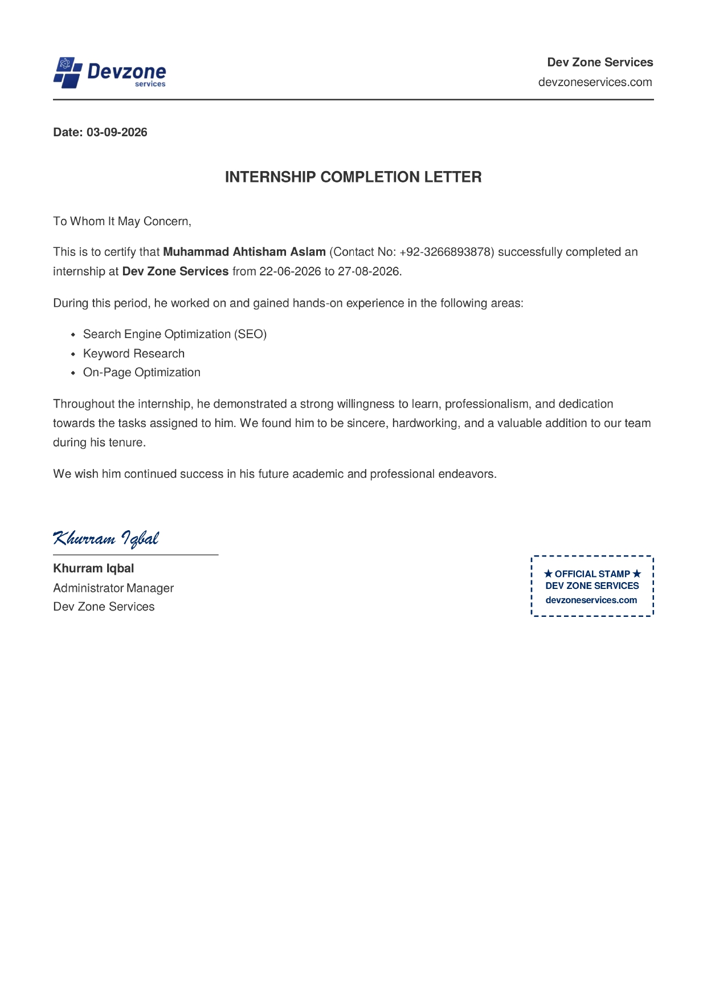
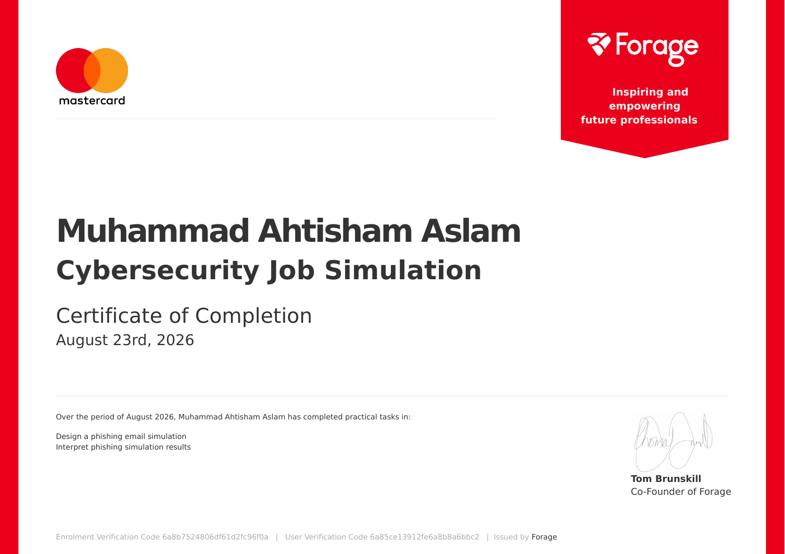
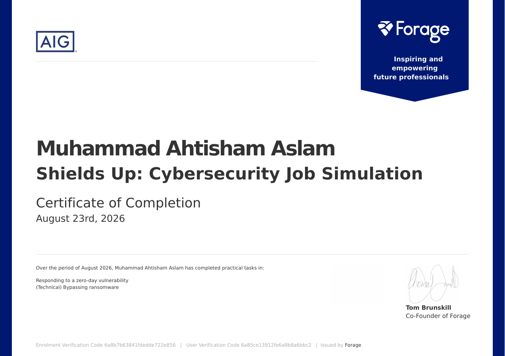
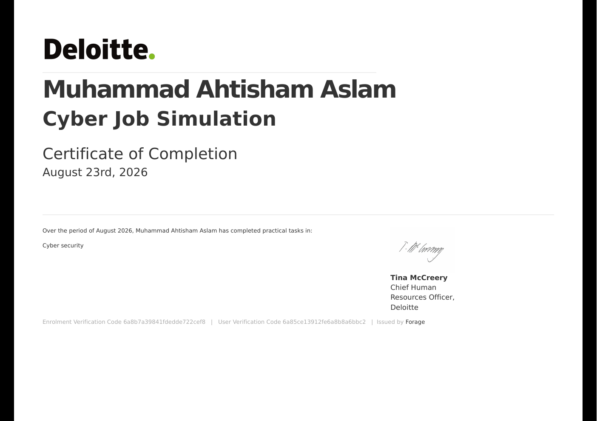
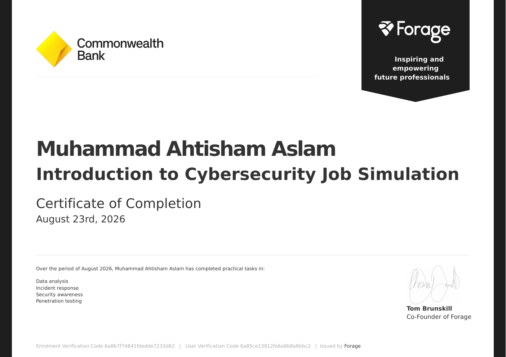
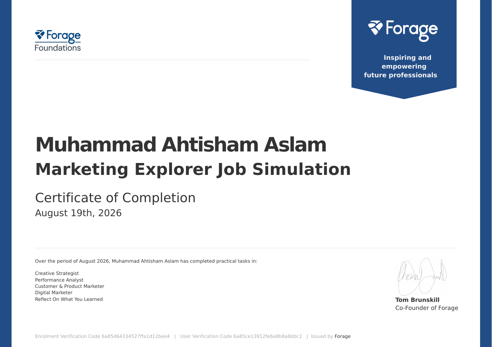

 
 

Muhammad Ahtisham Aslam

🛡️ Cybersecurity Student · Web Security · Python · Technical SEO

Building practical security tools, web-focused projects, and useful digital systems through hands-on learning.

 

🛡️ 01 — About Me

I'm a BS Information Technology student with a growing focus on cybersecurity, web security, vulnerability assessment, Python security tooling, Linux, and technical SEO.

I learn primarily by building practical projects rather than only following theoretical material.

My current work includes security-focused Python tools, authentication log analysis, phishing detection, web security testing, and technical SEO automation.

I'm especially interested in understanding how websites, applications, systems, and security controls work together.

<table>
<tr>

<td align="center" width="25%">

🛡️ SECURITY

Web Security
Vulnerability Assessment
OWASP Concepts
Security Testing

</td>

<td align="center" width="25%">

🐍 PYTHON

Security Tooling
Automation
Log Analysis
Data Processing

</td>

<td align="center" width="25%">

🖥️ LINUX & WEB

Linux
HTML · CSS · JavaScript
SQL
Git & GitHub

</td>

<td align="center" width="25%">

🔎 SEO

Technical SEO
Website Auditing
Keyword Research
On-Page Optimization

</td>

</tr>
</table>

🚀 02 — Currently Building

<table>
<tr>

<td width="33%" valign="top">

Mini-SIEM

A lightweight SIEM-style project for collecting authentication logs, analyzing activity, and identifying suspicious events.

Focus

Python Linux Log Analysis

 

<a href="https://github.com/ahtisham-sec/mini-siem-auth-log-analyzer">
View Repository →
</a>

</td>

<td width="33%" valign="top">

Phishing URL Detector

A Python-based project focused on analyzing URLs and identifying potentially suspicious links using security-oriented detection logic.

Focus

Python URL Analysis Detection

 

<a href="https://github.com/ahtisham-sec/phishing-url-threat-detector">
View Repository →
</a>

</td>

<td width="33%" valign="top">

🔎 SEO Audit Engine

An automated technical SEO auditing tool designed to identify common website optimization issues.

Focus

Python SEO Automation

 

<a href="https://github.com/ahtisham-sec/seo-audit-engine">
View Repository →
</a>

</td>

</tr>
</table>

💻 03 — Selected Projects

<table>
<tr>

<td width="50%" valign="top">

🌐 Web Security Scanner

A practical security testing project focused on identifying common web security issues and supporting security-oriented website analysis.

Python

 

<a href="https://github.com/ahtisham-sec/web-security-scanner">
Open Project →
</a>

</td>

<td width="50%" valign="top">

✍️ SEO Content Optimizer

A utility focused on analyzing on-page SEO signals and supporting content optimization workflows.

Python

 

<a href="https://github.com/ahtisham-sec/Seo-content-optimizer-">
Open Project →
</a>

</td>

</tr>
</table>

💼 04 — Experience

🧑‍💻 Dev Zone Services

🔎 SEO Intern

22 June 2026 - 27 August 2026

During my internship, I worked on practical SEO tasks including:

Search Engine Optimization · Keyword Research · On-Page Optimization

Internship Completion

 

Internship Completion Letter

🧪 05 — Cybersecurity Job Simulations

These simulations gave me practical exposure to different cybersecurity roles, security scenarios, analysis tasks, and incident-related workflows.

<table>
<tr>

<td width="50%" valign="top">

🛡️ Mastercard

🛡️ Cybersecurity Job Simulation

Practical tasks included:

Phishing email simulation

Phishing simulation result interpretation

 

</td>

<td width="50%" valign="top">

⚔️ AIG

Shields Up: Cybersecurity Job Simulation

Practical tasks included:

Responding to a zero-day vulnerability

Technical ransomware bypass task

 

</td>

</tr>

<tr>

<td width="50%" valign="top">

🔐 Deloitte

Cyber Job Simulation

Completed a practical cybersecurity job simulation covering real-world security-oriented tasks and scenarios.

 

</td>

<td width="50%" valign="top">

🏦 Commonwealth Bank

Introduction to Cybersecurity Job Simulation

Practical exposure to:

Data analysis

Incident response

Security awareness

Penetration testing

 

</td>

</tr>

<tr>

<td width="50%" valign="top">

📣 Marketing Explorer

📣 Marketing Explorer Job Simulation

Practical tasks covering:

Creative Strategy

Performance Analysis

Customer & Product Marketing

Digital Marketing

 

</td>

<td width="50%" valign="top">

🎨 Branding & Design

🎨 Branding & Design Job Simulation

Practical tasks covering:

Brand & Authenticity

Product Design & Craft

Digital Marketing

Community Building

 

</td>

</tr>
</table>

🎓 06 — Certifications & Courses

My certifications and completed courses include cybersecurity, governance, AI, and technical skills.

<table>
<tr>

<td width="50%" valign="top">

🔐 Google — Foundations of Cybersecurity

Provider: Google / Coursera
Year: 2026

Practical foundation in cybersecurity concepts, security roles, risks, threats, and defensive practices.

 

<a href="./assets/credentials/Coursera%200S1N8Y9PUB43.pdf">
View Certificate PDF →
</a>

</td>

<td width="50%" valign="top">

🏛️ Macquarie University — Cyber Security: GRC Part 1

Focus: Governance
Provider: Macquarie University / Coursera
Year: 2026

Introduction to governance, risk, and compliance concepts within cybersecurity.

 

<a href="./assets/credentials/Coursera%2043MPXQFOLJ4R.pdf">
View Certificate PDF →
</a>

</td>

</tr>

<tr>

<td width="50%" valign="top">

🤖 Google — Introduction to AI

Provider: Google / Coursera
Year: 2025

Introduction to artificial intelligence concepts and practical AI fundamentals.

 

<a href="./assets/credentials/Coursera%20P8MUEUGRYC33.pdf">
View Certificate PDF →
</a>

</td>

<td width="50%" valign="top">

📂 Additional Credentials

My assets/credentials/ directory also contains supporting certificate files and completed job simulation credentials.

 

<a href="./assets/credentials/">
Browse Credentials →
</a>

</td>

</tr>
</table>

🧰 07 — Technical Skills

 

🛡️ Cybersecurity

Web Security Vulnerability Assessment OWASP Phishing Detection Security Testing SIEM Basics Log Analysis

🐍 Programming

Python JavaScript SQL HTML CSS

⚙️ Systems & Tools

Linux Git GitHub VS Code

🌐 Web & Digital

Technical SEO WordPress Shopify Website Auditing

🎯 08 — Learning Focus

My current learning direction is centered around practical cybersecurity.

<table>
<tr>

<td width="33%" align="center">

🔎 Web Security

Understanding common web vulnerabilities, security testing, and secure application behavior.

</td>

<td width="33%" align="center">

⚙️ Security Automation

Building Python tools for detection, analysis, automation, and security workflows.

</td>

<td width="33%" align="center">

🐧 Linux & Security

Improving Linux administration, permissions, processes, networking, logs, and security monitoring.

</td>

</tr>
</table>

📌 09 — What I'm Working Toward

I'm building my skills toward entry-level opportunities in:

Cybersecurity · Web Security · Security Testing · SOC / SIEM · Python Security Tooling

My approach is simple:

Learn → Build → Test → Document → Improve

  
 

🤝 10 — Connect With Me

 
 

Open to cybersecurity opportunities, internships, freelance projects, and technical collaboration.

🛡️ SECURE · BUILD · LEARN

Learning through practical work, one project at a time.

